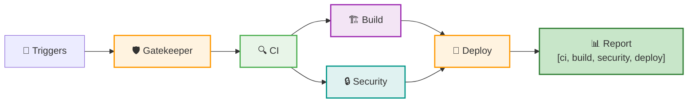

# 🚀 Quick Reference - Gatekeeper Workflows

## 🎯 Common Commands

### Manual Triggers

| Action | Steps |
|--------|-------|
| **Run All Workflows** | Actions → Gatekeeper → Run workflow → `run_workflows: all` |
| **Code Quality Only** | Actions → Gatekeeper → Run workflow → `run_workflows: ci` |
| **Build & Security Only** | Actions → Gatekeeper → Run workflow → `run_workflows: build,security` |
| **Force Deploy** | Actions → Gatekeeper → Run workflow → `force_deploy: true` |
| **Test Branch** | Actions → Gatekeeper → Run workflow → `ref: feature-branch` |
| **🐛 Enable Debug Mode** | Actions → Gatekeeper → Run workflow → `debug_mode: true` |

### Individual Workflows

| Workflow | Purpose | Manual Trigger |
|----------|---------|----------------|
| `ci.yml` | 🔍 Linting & Type Check | Actions → "CI - Linting & Type Checking" |
| `build.yml` | 🏗️ Build & Validate | Actions → "Build - Application Build & Validation" |
| `security.yml` | 🔒 Security | Actions → "Security & Dependencies" |
| `deploy.yml` | 🚀 Deploy | Actions → "Deploy - Vercel Deployment" |

## 📊 Status Arrays

```json
// Pipeline Status
["PASSED", "PASSED", "PASSED", "PASSED"]  // ✅ All workflows passed
["FAILED", "SKIPPED", "SKIPPED", "SKIPPED"] // ❌ CI failed
["PASSED", "FAILED", "SKIPPED", "SKIPPED"]  // ❌ Build failed
["PASSED", "PASSED", "FAILED", "SKIPPED"]   // ❌ Security failed
["PASSED", "PASSED", "PASSED", "FAILED"]    // ❌ Deploy failed

// Workflow Order
//  ci       build     security  deploy
```

## ⚙️ Required Secrets

```bash
# For Vercel Deployment
VERCEL_TOKEN    # Vercel API token
ORG_ID         # Vercel organization ID
PROJECT_ID     # Vercel project ID
```

## 🔧 Local Testing

```bash
# Before pushing, run locally:
npm run lint          # Check linting
npx tsc --noEmit     # Check types  
npm run build        # Check build
```

## 🛡️ Gatekeeper Flow



## 🐛 Debug Mode

### Enable Debug Logging

| Method | Command |
|--------|---------|
| **Gatekeeper (All Workflows)** | Set `debug_mode: true` in workflow dispatch |
| **Individual Workflow** | Set `debug_mode: true` in each workflow |
| **Environment Variables** | `ACTIONS_STEP_DEBUG=true` & `ACTIONS_RUNNER_DEBUG=true` |

### Debug Features

- ✅ **Verbose npm logging** (`NPM_CONFIG_LOGLEVEL=verbose`)
- ✅ **Next.js debug mode** (`NEXT_DEBUG=true`)
- ✅ **Vercel debug output** (`VERCEL_DEBUG=1`)
- ✅ **Step-by-step execution** (GitHub Actions debug)
- ✅ **Detailed error messages** (Enhanced logging)

## 🚨 Emergency Actions

| Issue | Solution |
|-------|----------|
| **All workflows failing** | Run individual workflows to isolate |
| **Need urgent deploy** | Use `force_deploy: true` |
| **Test specific fix** | Use `ref: commit-hash` |
| **Skip security** | Use `run_workflows: ci,build,deploy` |
| **Debug workflow issues** | Use `debug_mode: true` |
| **Security vulnerabilities** | Run `./scripts/security-update.sh` |
| **Package updates needed** | `npm install next@latest axios@latest` |

---
