# 🚀 Quick Reference - Gatekeeper Workflows

## 🎯 Common Commands

### Manual Triggers

| Action | Steps |
|--------|-------|
| **Run All Workflows** | Actions → Gatekeeper → Run workflow → `run_workflows: all` |
| **Code Quality Only** | Actions → Gatekeeper → Run workflow → `run_workflows: ci` |
| **Build & Security Only** | Actions → Gatekeeper → Run workflow → `run_workflows: build,security` |
| **Force Deploy** | Actions → Gatekeeper → Run workflow → `force_deploy: true` |
| **Test Branch** | Actions → Gatekeeper → Run workflow → `ref: feature-branch` |

### Individual Workflows

| Workflow | Purpose | Manual Trigger |
|----------|---------|----------------|
| `ci.yml` | 🔍 Linting & Type Check | Actions → "CI - Linting & Type Checking" |
| `build.yml` | 🏗️ Build & Validate | Actions → "Build - Application Build & Validation" |
| `security.yml` | 🔒 Security | Actions → "Security & Dependencies" |
| `deploy.yml` | 🚀 Deploy | Actions → "Deploy - Vercel Deployment" |

## 📊 Status Arrays

```json
// Pipeline Status
["PASSED", "PASSED", "PASSED", "PASSED"]  // ✅ All workflows passed
["FAILED", "SKIPPED", "SKIPPED", "SKIPPED"] // ❌ CI failed
["PASSED", "FAILED", "SKIPPED", "SKIPPED"]  // ❌ Build failed
["PASSED", "PASSED", "FAILED", "SKIPPED"]   // ❌ Security failed
["PASSED", "PASSED", "PASSED", "FAILED"]    // ❌ Deploy failed

// Workflow Order
//  ci       build     security  deploy
```

## ⚙️ Required Secrets

```bash
# For Vercel Deployment
VERCEL_TOKEN    # Vercel API token
ORG_ID         # Vercel organization ID
PROJECT_ID     # Vercel project ID
```

## 🔧 Local Testing

```bash
# Before pushing, run locally:
npm run lint          # Check linting
npx tsc --noEmit     # Check types  
npm run build        # Check build
```

## 🛡️ Gatekeeper Flow

```mermaid
graph LR
    A["🎯 Triggers"] --> B["🛡️ Gatekeeper"]
    B --> C["🔍 CI"]
    C --> D["🏗️ Build"]
    C --> E["🔒 Security"]
    D --> F["🚀 Deploy"]
    E --> F
    F --> G["📊 Report<br/>[ci, build, security, deploy]"]
    
    style B fill:#fff3e0,stroke:#ff9800,stroke-width:2px
    style C fill:#e8f5e8,stroke:#4caf50,stroke-width:2px
    style D fill:#f3e5f5,stroke:#9c27b0,stroke-width:2px
    style E fill:#e0f2f1,stroke:#009688,stroke-width:2px
    style F fill:#fff3e0,stroke:#ff9800,stroke-width:2px
    style G fill:#c8e6c9,stroke:#2e7d32,stroke-width:2px
```



## 🚨 Emergency Actions

| Issue | Solution |
|-------|----------|
| **All workflows failing** | Run individual workflows to isolate |
| **Need urgent deploy** | Use `force_deploy: true` |
| **Test specific fix** | Use `ref: commit-hash` |
| **Skip security** | Use `run_workflows: ci,build,deploy` |
| **Security vulnerabilities** | Run `./scripts/security-update.sh` |
| **Package updates needed** | `npm install next@latest axios@latest` |

---
