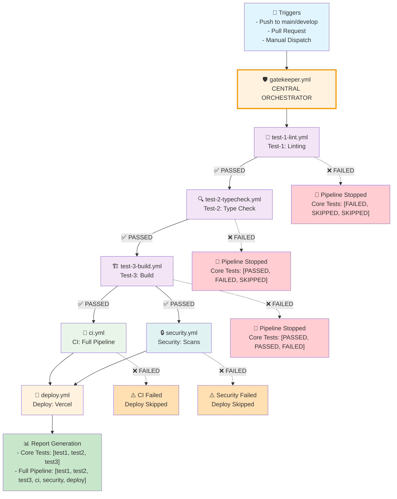

# 🛡️ GitHub Actions Workflows - Gatekeeper Architecture

This repository uses a **centralized gatekeeper pattern** for CI/CD operations, where all workflows are orchestrated through a single entry point while maintaining individual workflow flexibility.

## 📋 Table of Contents

- [🏗️ Architecture Overview](#️-architecture-overview)
- [🛡️ Gatekeeper Workflow](#️-gatekeeper-workflow)
- [📁 Workflow Files](#-workflow-files)
- [🚀 Usage Examples](#-usage-examples)
- [📊 Reporting System](#-reporting-system)
- [⚙️ Configuration](#️-configuration)
- [🔧 Troubleshooting](#-troubleshooting)

## 🏗️ Architecture Overview



## 🛡️ Gatekeeper Workflow

The **gatekeeper.yml** is the central orchestrator that manages all CI/CD operations:

### Sequential Execution Flow

1. **Core Tests** (Sequential):
   - `test-1-lint.yml` → Code linting and style checks
   - `test-2-typecheck.yml` → TypeScript type validation
   - `test-3-build.yml` → Application build verification

2. **Extended Pipeline** (Parallel after core tests):
   - `ci.yml` → Full CI pipeline with comprehensive testing
   - `security.yml` → Security scans and dependency audits

3. **Deployment** (After CI + Security):
   - `deploy.yml` → Vercel deployment (main branch only)

### Key Features

- ✅ **Sequential Core Tests** - Each must pass before the next begins
- ✅ **Parallel Extended Pipeline** - CI and Security run simultaneously
- ✅ **Failure Stops Pipeline** - Any failure prevents dependent workflows
- ✅ **Comprehensive Reporting** - Multiple report formats available
- ✅ **Flexible Execution** - Run specific workflows or all workflows

## 📁 Workflow Files

| File | Purpose | Trigger | Dependencies |
|------|---------|---------|--------------|
| `gatekeeper.yml` | 🛡️ Central orchestrator | Push, PR, Manual | None |
| `test-1-lint.yml` | 📝 ESLint code linting | Called by gatekeeper | None |
| `test-2-typecheck.yml` | 🔍 TypeScript validation | Called by gatekeeper | test-1 |
| `test-3-build.yml` | 🏗️ Next.js build verification | Called by gatekeeper | test-2 |
| `ci.yml` | 🔄 Full CI pipeline | Called by gatekeeper | test-3 |
| `security.yml` | 🔒 Security & dependency scans | Called by gatekeeper | test-3 |
| `deploy.yml` | 🚀 Vercel deployment | Called by gatekeeper | ci + security |

### Individual Workflow Capabilities

All workflows support:
- ✅ **Manual triggering** via `workflow_dispatch`
- ✅ **Custom Git ref** specification (branch/tag/commit)
- ✅ **Standalone execution** independent of gatekeeper
- ✅ **Network retry logic** for npm connectivity issues

## 🚀 Usage Examples

### Automatic Triggers

```yaml
# Automatically triggered on:
- Push to main/develop branches
- Pull requests to main branch
```

### Manual Triggers

#### Run Full Gatekeeper Pipeline
```bash
# Via GitHub Actions UI:
# 1. Go to Actions tab
# 2. Select "🛡️ Gatekeeper - Central Orchestrator"
# 3. Click "Run workflow"
# 4. Configure options:
#    - ref: main (or any branch/tag/commit)
#    - run_workflows: all
#    - force_deploy: false
```

#### Run Specific Workflows
```yaml
# Core tests only
run_workflows: "test1,test2,test3"

# CI and Security only
run_workflows: "ci,security"

# Everything except deployment
run_workflows: "test1,test2,test3,ci,security"

# Force deployment even if tests fail
force_deploy: true
```

#### Test Specific Branch
```yaml
# Test a feature branch
ref: "feature/new-component"

# Test a specific commit
ref: "abc123def456"

# Test a tag
ref: "v1.2.3"
```

### Individual Workflow Execution

```bash
# Run only CI pipeline
# Actions → "CI - Full Pipeline" → Run workflow

# Run only security scans
# Actions → "Security & Dependencies" → Run workflow

# Run only deployment
# Actions → "Deploy to Vercel" → Run workflow
```

## 📊 Reporting System

The gatekeeper generates comprehensive reports in multiple formats:

### Core Tests Array
```json
["PASSED", "PASSED", "PASSED"]
["FAILED", "SKIPPED", "SKIPPED"] 
["PASSED", "FAILED", "SKIPPED"]
["PASSED", "PASSED", "FAILED"]
```

### Full Pipeline Array
```json
["PASSED", "PASSED", "PASSED", "PASSED", "PASSED", "PASSED"]
// test1    test2     test3     ci      security  deploy
```

### Status Values
- `PASSED` ✅ - Workflow completed successfully
- `FAILED` ❌ - Workflow failed with errors
- `SKIPPED` ⏭️ - Workflow was skipped due to dependencies
- `CANCELLED` ⏸️ - Workflow was manually cancelled

### Report Locations
- **GitHub Actions Summary** - Visual report with emojis
- **Console Output** - Text-based status in workflow logs
- **Step Summary** - Markdown formatted report
- **Workflow Outputs** - Programmatic access to results

## ⚙️ Configuration

### Required Secrets (for Vercel Deployment)

Add these secrets in **Repository Settings → Secrets and variables → Actions**:

```bash
VERCEL_TOKEN      # Your Vercel API token
ORG_ID           # Your Vercel organization ID  
PROJECT_ID       # Your Vercel project ID
```

### Optional Configuration

#### Workflow Customization
```yaml
# In gatekeeper.yml, modify default behaviors:

# Change default branch
default: 'develop'

# Modify workflow selection
default: 'test1,test2,test3,ci'  # Skip security and deploy

# Adjust deployment conditions
if: github.ref == 'refs/heads/production'  # Deploy only from production
```

#### Network Retry Settings
```yaml
# All workflows include retry logic for npm install:
for i in {1..3}; do  # 3 attempts
  npm ci --prefer-offline --no-audit
  sleep 10  # 10 second delay between retries
done
```

## 🔧 Troubleshooting

### Common Issues

#### 1. **Deployment Fails with "Missing Vercel Token"**
```bash
# Solution: Add required secrets
VERCEL_TOKEN, ORG_ID, PROJECT_ID

# Or: Skip deployment gracefully (workflow continues)
# The deploy workflow handles missing secrets automatically
```

#### 2. **npm Install Fails with ECONNRESET**
```bash
# Solution: Workflows include automatic retry logic
# If persistent, check:
# - GitHub Actions status page
# - npm registry status
# - Repository network settings
```

#### 3. **TypeScript Errors in CI**
```bash
# Solution: Run locally first
npm run lint          # Check linting
npx tsc --noEmit      # Check types
npm run build         # Check build

# Fix errors locally, then push
```

#### 4. **Workflow Doesn't Trigger**
```bash
# Check:
# - Branch protection rules
# - Workflow file syntax (YAML validation)
# - Repository permissions
# - GitHub Actions enabled in settings
```

### Security Vulnerabilities

If security scans fail due to vulnerabilities:

1. **Check the vulnerability report** in the workflow logs
2. **Run the security update script**:
   ```bash
   ./scripts/security-update.sh
   ```
3. **Manual package updates**:
   ```bash
   # Update specific vulnerable packages
   npm install next@latest axios@latest
   npm update  # Update all packages
   ```
4. **Test after updates**:
   ```bash
   npm run build
   npm run lint
   npm audit --audit-level high
   ```

### Debug Mode

Enable debug logging by adding this secret:
```bash
ACTIONS_STEP_DEBUG = true
```

### Manual Intervention

If gatekeeper fails, you can:

1. **Run individual workflows** to isolate issues
2. **Use force_deploy** to skip failed tests
3. **Specify custom ref** to test fixes
4. **Check workflow logs** for detailed error messages

## 🎯 Best Practices

### For Developers

1. **Test locally** before pushing:
   ```bash
   npm run lint
   npm run build
   npx tsc --noEmit
   ```

2. **Use feature branches** for development
3. **Check gatekeeper status** before merging PRs
4. **Review workflow logs** when failures occur

### For Maintainers

1. **Monitor gatekeeper reports** regularly
2. **Keep secrets updated** (Vercel tokens, etc.)
3. **Review security scan results** weekly
4. **Update dependencies** based on audit reports

## 📈 Workflow Statistics

The gatekeeper tracks:
- ✅ **Success Rate** - Percentage of successful runs
- ⏱️ **Execution Time** - Time for each workflow stage
- 🔄 **Retry Attempts** - Network retry statistics
- 📊 **Failure Patterns** - Common failure points

---

**🛡️ Gatekeeper Status**: All systems operational ✅  
**📅 Last Updated**: $(date)  
**🔗 Repository**: [mavgrades](https://github.com/your-username/mavgrades)
