# 🛡️ GitHub Actions Workflows - Gatekeeper Architecture

This repository uses a **centralized gatekeeper pattern** for CI/CD operations, where all workflows are orchestrated through a single entry point while maintaining individual workflow flexibility.

## 📋 Table of Contents

- [🏗️ Architecture Overview](#️-architecture-overview)
- [🛡️ Gatekeeper Workflow](#️-gatekeeper-workflow)
- [📁 Workflow Files](#-workflow-files)
- [🚀 Usage Examples](#-usage-examples)
- [📊 Reporting System](#-reporting-system)
- [⚙️ Configuration](#️-configuration)
- [🔧 Troubleshooting](#-troubleshooting)

## 🏗️ Architecture Overview

```mermaid
graph TB
    subgraph "🎯 TRIGGER EVENTS"
        T1["📤 Push to main/develop"]
        T2["🔀 Pull Request"] 
        T3["🎮 Manual Dispatch"]
    end
    
    T1 --> GK
    T2 --> GK
    T3 --> GK
    
    subgraph "🛡️ GATEKEEPER ORCHESTRATOR"
        GK["gatekeeper.yml<br/>🎭 Central Control<br/>• Sequential execution<br/>• Failure handling<br/>• Report generation"]
    end
    
    subgraph "🔍 STAGE 1: CODE QUALITY"
        CI["ci.yml<br/>📝 Linting & Type Check<br/>• ESLint validation<br/>• TypeScript checking<br/>• Code style enforcement"]
    end
    
    subgraph "⚡ STAGE 2: PARALLEL EXECUTION"
        BUILD["build.yml<br/>🏗️ Build & Validation<br/>• Next.js compilation<br/>• Build artifact creation<br/>• Asset validation"]
        
        SEC["security.yml<br/>🔒 Security Scanning<br/>• npm audit (critical only)<br/>• Dependency checking<br/>• CodeQL analysis"]
    end
    
    subgraph "🚀 STAGE 3: DEPLOYMENT"
        DEPLOY["deploy.yml<br/>🌐 Vercel Deployment<br/>• Production deployment<br/>• Environment validation<br/>• Status confirmation"]
    end
    
    subgraph "📊 STAGE 4: REPORTING"
        REPORT["📈 Status Report<br/>Array: [ci, build, security, deploy]<br/>• Success tracking<br/>• Failure isolation"]
    end
    
    GK --> CI
    CI -->|"✅ PASSED"| BUILD
    CI -->|"✅ PASSED"| SEC
    BUILD -->|"✅ PASSED"| DEPLOY
    SEC -->|"✅ PASSED"| DEPLOY
    DEPLOY --> REPORT
    
    CI -.->|"❌ FAILED"| STOP1["🛑 [FAILED, SKIPPED, SKIPPED, SKIPPED]"]
    BUILD -.->|"❌ FAILED"| STOP2["🛑 [PASSED, FAILED, SKIPPED, SKIPPED]"]
    SEC -.->|"❌ FAILED"| STOP3["🛑 [PASSED, PASSED, FAILED, SKIPPED]"]
    
    subgraph "🎛️ MANUAL CONTROLS"
        M1["Individual Workflow Triggers<br/>• ci.yml standalone<br/>• build.yml standalone<br/>• security.yml standalone<br/>• deploy.yml standalone"]
        M2["Gatekeeper Options<br/>• run_workflows: 'ci,build'<br/>• force_deploy: true<br/>• ref: 'feature-branch'"]
    end
    
    M1 -.-> CI
    M1 -.-> BUILD  
    M1 -.-> SEC
    M1 -.-> DEPLOY
    M2 -.-> GK
    
    style GK fill:#fff3e0,stroke:#ff9800,stroke-width:3px
    style CI fill:#e8f5e8,stroke:#4caf50,stroke-width:2px
    style BUILD fill:#f3e5f5,stroke:#9c27b0,stroke-width:2px
    style SEC fill:#e0f2f1,stroke:#009688,stroke-width:2px
    style DEPLOY fill:#fff3e0,stroke:#ff9800,stroke-width:2px
    style REPORT fill:#c8e6c9,stroke:#2e7d32,stroke-width:2px
    style STOP1 fill:#ffcdd2,stroke:#d32f2f,stroke-width:2px
    style STOP2 fill:#ffcdd2,stroke:#d32f2f,stroke-width:2px
    style STOP3 fill:#ffe0b2,stroke:#f57c00,stroke-width:2px
    style T1 fill:#e1f5fe,stroke:#0277bd,stroke-width:1px
    style T2 fill:#e1f5fe,stroke:#0277bd,stroke-width:1px
    style T3 fill:#fce4ec,stroke:#c2185b,stroke-width:1px
    style M1 fill:#f1f8e9,stroke:#689f38,stroke-width:1px
    style M2 fill:#f1f8e9,stroke:#689f38,stroke-width:1px
```



### 🔄 **Execution Flow Summary**

1. **🎯 Trigger** → Any push, PR, or manual dispatch activates the gatekeeper
2. **🔍 Code Quality** → ESLint + TypeScript validation (must pass to continue)
3. **⚡ Parallel Stage** → Build creation & Security scanning (run simultaneously)
4. **🚀 Deployment** → Vercel deployment (only if build + security pass)
5. **📊 Reporting** → Clean status array: `[ci, build, security, deploy]`

### ✨ **Key Architecture Benefits**

- ✅ **No Duplication** - Single npm install per workflow
- ✅ **Parallel Efficiency** - Build & Security run together after CI
- ✅ **Clear Dependencies** - Each stage has defined prerequisites  
- ✅ **Fast Failure** - Pipeline stops immediately on any failure
- ✅ **Flexible Control** - Individual workflows can run standalone
- ✅ **Clean Reporting** - Simple 4-element status array

## 🛡️ Gatekeeper Workflow

The **gatekeeper.yml** is the central orchestrator that manages all CI/CD operations:

### Streamlined Execution Flow

1. **Code Quality** (First):
   - `ci.yml` → ESLint linting + TypeScript type checking

2. **Build & Security** (Parallel after code quality):
   - `build.yml` → Next.js build + validation + artifact upload
   - `security.yml` → Security scans and dependency audits

3. **Deployment** (After build + security):
   - `deploy.yml` → Vercel deployment (main branch only)

### Key Features

- ✅ **Streamlined Architecture** - No duplicate setup code across workflows
- ✅ **Single Responsibility** - Each workflow has one focused purpose
- ✅ **Optimized Dependencies** - Single npm install per workflow
- ✅ **Parallel Execution** - Build and Security run simultaneously after CI
- ✅ **Failure Stops Pipeline** - Any failure prevents dependent workflows
- ✅ **Comprehensive Reporting** - Clean array format: `[ci, build, security, deploy]`
- ✅ **Flexible Execution** - Run specific workflows or all workflows

## 📁 Workflow Files

| File | Purpose | Trigger | Dependencies |
|------|---------|---------|--------------|
| `gatekeeper.yml` | 🛡️ Central orchestrator | Push, PR, Manual | None |
| `ci.yml` | 🔍 Linting & type checking | Called by gatekeeper | None |
| `build.yml` | 🏗️ Build & validation + artifacts | Called by gatekeeper | ci |
| `security.yml` | 🔒 Security & dependency scans | Called by gatekeeper | ci |
| `deploy.yml` | 🚀 Vercel deployment only | Called by gatekeeper | build + security |

### Individual Workflow Capabilities

All workflows support:
- ✅ **Manual triggering** via `workflow_dispatch`
- ✅ **Custom Git ref** specification (branch/tag/commit)
- ✅ **Standalone execution** independent of gatekeeper
- ✅ **Single dependency installation** (no redundant downloads)
- ✅ **Optimized performance** with focused responsibilities

## 🚀 Usage Examples

### Automatic Triggers

```yaml
# Automatically triggered on:
- Push to main/develop branches
- Pull requests to main branch
```

### Manual Triggers

#### Run Full Gatekeeper Pipeline
```bash
# Via GitHub Actions UI:
# 1. Go to Actions tab
# 2. Select "🛡️ Gatekeeper - Central Orchestrator"
# 3. Click "Run workflow"
# 4. Configure options:
#    - ref: main (or any branch/tag/commit)
#    - run_workflows: all
#    - force_deploy: false
```

#### Run Specific Workflows
```yaml
# Code quality only
run_workflows: "ci"

# Build and security only
run_workflows: "build,security"

# Everything except deployment
run_workflows: "ci,build,security"

# Force deployment even if tests fail
force_deploy: true
```

#### Test Specific Branch
```yaml
# Test a feature branch
ref: "feature/new-component"

# Test a specific commit
ref: "abc123def456"

# Test a tag
ref: "v1.2.3"
```

### Individual Workflow Execution

```bash
# Run only CI (linting & type checking)
# Actions → "CI - Linting & Type Checking" → Run workflow

# Run only build
# Actions → "Build - Application Build & Validation" → Run workflow

# Run only security scans
# Actions → "Security & Dependencies" → Run workflow

# Run only deployment
# Actions → "Deploy - Vercel Deployment" → Run workflow
```

## 📊 Reporting System

The gatekeeper generates comprehensive reports in a clean array format:

### Pipeline Array
```json
["PASSED", "PASSED", "PASSED", "PASSED"]
//  ci       build     security  deploy
```

### Example Status Combinations
```json
["PASSED", "PASSED", "PASSED", "PASSED"]  // ✅ Full success
["FAILED", "SKIPPED", "SKIPPED", "SKIPPED"] // ❌ CI failed
["PASSED", "FAILED", "SKIPPED", "SKIPPED"]  // ❌ Build failed
["PASSED", "PASSED", "FAILED", "SKIPPED"]   // ❌ Security failed
["PASSED", "PASSED", "PASSED", "FAILED"]    // ❌ Deploy failed
```

### Status Values
- `PASSED` ✅ - Workflow completed successfully
- `FAILED` ❌ - Workflow failed with errors
- `SKIPPED` ⏭️ - Workflow was skipped due to dependencies
- `CANCELLED` ⏸️ - Workflow was manually cancelled

### Report Locations
- **GitHub Actions Summary** - Visual report with emojis
- **Console Output** - Text-based status in workflow logs
- **Step Summary** - Markdown formatted report
- **Workflow Outputs** - Programmatic access to results

## ⚙️ Configuration

### Required Secrets (for Vercel Deployment)

Add these secrets in **Repository Settings → Secrets and variables → Actions**:

```bash
VERCEL_TOKEN      # Your Vercel API token
ORG_ID           # Your Vercel organization ID  
PROJECT_ID       # Your Vercel project ID
```

### Optional Configuration

#### Workflow Customization
```yaml
# In gatekeeper.yml, modify default behaviors:

# Change default branch
default: 'develop'

# Modify workflow selection
default: 'test1,test2,test3,ci'  # Skip security and deploy

# Adjust deployment conditions
if: github.ref == 'refs/heads/production'  # Deploy only from production
```

#### Network Retry Settings
```yaml
# All workflows include retry logic for npm install:
for i in {1..3}; do  # 3 attempts
  npm ci --prefer-offline --no-audit
  sleep 10  # 10 second delay between retries
done
```

## 🔧 Troubleshooting

### Common Issues

#### 1. **Deployment Fails with "Missing Vercel Token"**
```bash
# Solution: Add required secrets
VERCEL_TOKEN, ORG_ID, PROJECT_ID

# Or: Skip deployment gracefully (workflow continues)
# The deploy workflow handles missing secrets automatically
```

#### 2. **npm Install Fails with ECONNRESET**
```bash
# Solution: Workflows include automatic retry logic
# If persistent, check:
# - GitHub Actions status page
# - npm registry status
# - Repository network settings
```

#### 3. **TypeScript Errors in CI**
```bash
# Solution: Run locally first
npm run lint          # Check linting
npx tsc --noEmit      # Check types
npm run build         # Check build

# Fix errors locally, then push
```

#### 4. **Workflow Doesn't Trigger**
```bash
# Check:
# - Branch protection rules
# - Workflow file syntax (YAML validation)
# - Repository permissions
# - GitHub Actions enabled in settings
```

### Security Vulnerabilities

If security scans fail due to vulnerabilities:

1. **Check the vulnerability report** in the workflow logs
2. **Run the security update script**:
   ```bash
   ./scripts/security-update.sh
   ```
3. **Manual package updates**:
   ```bash
   # Update specific vulnerable packages (versions already updated)
   npm install axios@^1.8.2 next@^14.2.30
   
   # Or regenerate lock file after updating package.json
   rm package-lock.json
   npm install --package-lock-only
   npm ci
   ```
4. **Test after updates**:
   ```bash
   npm run build
   npm run lint
   npm audit --audit-level high
   ```

### Debug Mode

Enable debug logging by adding this secret:
```bash
ACTIONS_STEP_DEBUG = true
```

### Manual Intervention

If gatekeeper fails, you can:

1. **Run individual workflows** to isolate issues
2. **Use force_deploy** to skip failed tests
3. **Specify custom ref** to test fixes
4. **Check workflow logs** for detailed error messages

## 🎯 Best Practices

### For Developers

1. **Test locally** before pushing:
   ```bash
   npm run lint
   npm run build
   npx tsc --noEmit
   ```

2. **Use feature branches** for development
3. **Check gatekeeper status** before merging PRs
4. **Review workflow logs** when failures occur

### For Maintainers

1. **Monitor gatekeeper reports** regularly
2. **Keep secrets updated** (Vercel tokens, etc.)
3. **Review security scan results** weekly
4. **Update dependencies** based on audit reports

## 📈 Workflow Statistics

The gatekeeper tracks:
- ✅ **Success Rate** - Percentage of successful runs
- ⏱️ **Execution Time** - Time for each workflow stage
- 🔄 **Retry Attempts** - Network retry statistics
- 📊 **Failure Patterns** - Common failure points

---

**🛡️ Gatekeeper Status**: All systems operational ✅  
**📅 Last Updated**: $(date)  
**🔗 Repository**: [mavgrades](https://github.com/your-username/mavgrades)
